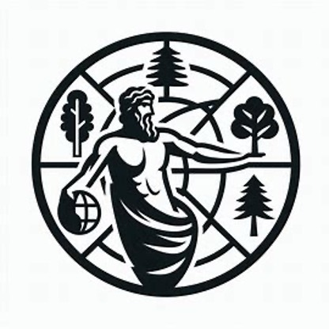

## ATLAS Project website

Website of the project ***ATLAS - Unlocking Functional Diversity in Homegardens***\
coordinated by Damien Beillouin and collaborators.

This website is built with the R package [`distill`](https://rstudio.github.io/distill/)\
and is available at: [**https://dbeillouin.github.io/ATLAS_WEB/**](https://dbeillouin.github.io/ATLAS_WEB/){.uri}
