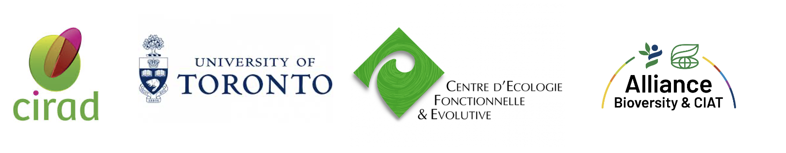

Website of the research initiative ***ATLAS – Unlocking the Functional Diversity of Homegardens***,\
led by **CIRAD** in collaboration with international partners including the University of Toronto, CEFE-CNRS, CGIAR, and others.

------------------------------------------------------------------------

**ATLAS** – *Analysis of Traits in Homegardens and Links to Agroecosystem Services* – is an international research initiative that explores how plant functional diversity in tropical homegardens supports resilient and sustainable food systems.

Homegardens are widespread across the tropics and combine crops, trees, and sometimes livestock in tightly managed spaces. They provide essential food, income, and ecosystem services to millions of rural households. Yet, the ecological roles of plant species within these systems remain poorly understood.

ATLAS addresses this gap by investigating how **plant functional traits** — such as leaf structure, nutrient content, or growth form — influence key ecosystem services, including carbon sequestration, water regulation, nutrient provisioning, and system resilience. By combining approaches from **functional ecology**, **trait-based analysis**, and **data science**, the project aims to generate actionable insights into the ecological functioning of homegardens.

The core activities of ATLAS include:

- Building an open-access, global **database** of plant traits specific to tropical homegardens  
- Comparing the **functional composition** of homegardens with other agroecosystems and forest systems  
- Linking plant traits to **quantifiable ecosystem services**  
- Supporting **evidence-based agroecological transitions**, with implications for biodiversity conservation and climate policy

### Project Team

### Project Team

| Name                  | Affiliation                        | ORCID                                      |
|-----------------------|----------------------------------|---------------------------------------------|
| Marney Isaac          | University of Toronto             |  |
| Cyrille Violle        | CNRS - CEFE, Montpellier          |  |
| Delphine Renard       | CNRS - CEFE, Montpellier          |  |
| Paul Fauchon          | CIRAD - HortSys (PhD Student)     |  |
| Bruno Rapidel         | CIRAD - ABSys                     |  |
| Sarah Jones           | CGIAR - Bioversity International |  |
| Collins Khoury        | San Diego Botanic Garden          |  |
| Natalia Estrada Carmona | Alliance Bioversity              |  |
| Damien Beillouin      | CIRAD - HortSys                  |  |

------------------------------------------------------------------------

This website is built using the R package [`distill`](https://rstudio.g)
